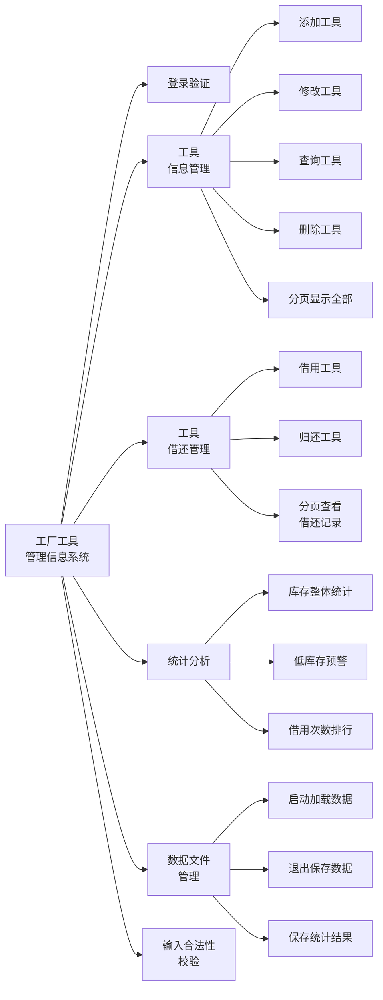
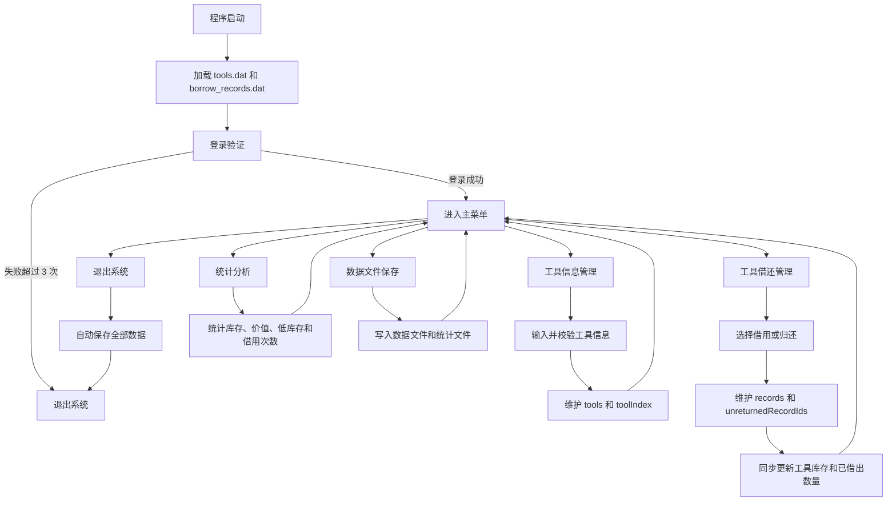
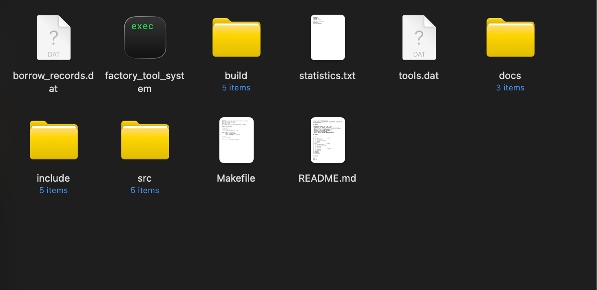

# 《程序设计课程实践》综合项目实验报告

## 项目名称

工厂工具管理信息系统

## 团队成员

| 学号 | 姓名 | 完成占比 |
| --- | --- | --- |
| 25051213 | 侯季南 | 50% |
| 25051209 | 艾冠伊 | 50% |

## 完成时间

2026 年 6 月

# 工厂工具管理信息系统项目实验报告

## 1. 团队成员组成及分工

| 学号 | 姓名 | 详细任务分工 |
| --- | :-: | --- |
| 25051213 | 侯季南 | 负责项目整体规划、系统功能模块设计、核心业务流程设计、代码整合与最终测试。负责借还管理、统计分析、文件持久化、实验报告整理及运行效果截图。 |
| 25051209 | 艾冠伊 | 负责工具信息管理模块，包括工具添加、修改、查询、删除、分页展示及 `std::map` 索引维护。 |

## 2. 开发背景

在工厂日常生产和设备维护过程中，扳手、电钻、螺丝刀、量具等工具通常种类较多、数量较大，并且存在频繁借用、归还、维修和库存补充等管理需求。如果完全依赖人工登记纸质表格，容易出现工具编号重复、库存统计不准确、借出记录遗失、归还状态不清晰等问题，从而影响生产效率和仓库管理质量。

本项目围绕“工厂工具管理”这一实际应用场景，设计并实现一个基于 C++ 的命令行工具管理信息系统。系统通过类封装工具信息和借还记录信息，借助 `std::map` 快速维护工具编号与工具对象之间的关系，使用 `std::set` 维护未归还记录编号，并利用本地文件实现工具数据和借还记录的永久保存。程序重启后可以自动加载已有数据，避免信息丢失。

本系统主要面向工厂工具仓库管理员使用，支持工具信息维护、工具借用归还、库存统计分析、低库存预警、借用次数排行等功能。通过本项目实践，可以综合训练 C++ 类设计、标准模板库容器、文件读写、输入合法性校验、菜单交互和模块化程序设计能力。

## 3. 系统功能设计

### 3.1 系统功能模块设计

系统整体分为登录验证、工具信息管理、工具借还管理、统计分析、数据文件管理和基础输入校验等模块。用户登录成功后进入主菜单，可以根据提示选择不同业务功能。工具信息管理模块负责维护工厂工具基础资料；借还管理模块负责记录工具借用和归还过程；统计分析模块负责汇总库存价值、发现低库存工具并统计工具借用频次；数据文件管理模块负责在程序启动和退出时完成数据加载与保存。



[图 1 系统功能模块图]

### 3.2 系统业务流程设计

系统启动后首先自动读取本地数据文件，加载工具信息和借还记录。随后用户输入账号和密码进行登录验证。登录成功后进入主菜单，用户可以选择工具信息管理、工具借还管理或统计分析等功能。执行新增、修改、借用、归还等操作时，系统会进行输入合法性检查，并同步更新内存中的容器数据。用户选择退出系统时，程序会自动保存工具信息、借还记录和统计结果，最后安全退出。



[图 2 业务流程图]

## 4. 项目创建

### 4.1 系统开发环境要求

本项目的开发及运行环境要求如下：

| 项目 | 内容 |
| --- | --- |
| 操作系统 | macOS |
| 开发工具 | Visual Studio Code |
| 编译器 | Apple Clang++ |
| 开发语言 | C++ |
| 语言标准 | C++17 |
| 构建方式 | Makefile |

### 4.2 项目创建过程

本项目采用多文件组织方式，便于维护和阅读。首先创建项目根目录，然后创建 `include`、`src`、`docs` 等子目录。其中 `include` 用于存放头文件，`src` 用于存放源代码实现文件，`docs` 用于存放项目文档和实验报告。

项目创建过程如下：

1. 创建项目目录 `工厂大作业`。
2. 创建 `include/` 目录，用于存放类声明和公共函数声明。
3. 创建 `src/` 目录，用于存放类成员函数和业务逻辑实现。
4. 创建 `docs/` 目录，用于存放使用说明、设计说明和实验报告。
5. 编写 `Makefile`，统一管理编译、运行和清理命令。
6. 编写 `.gitignore`，忽略编译产物和运行期数据文件。
7. 编写并拆分系统核心代码。
8. 使用 `make` 构建项目，并运行程序进行功能测试。

项目目录结构如下：

```text
.
├── include/
│   ├── BorrowRecord.h
│   ├── Constants.h
│   ├── FactoryToolSystem.h
│   ├── Tool.h
│   └── Utils.h
├── src/
│   ├── BorrowRecord.cpp
│   ├── FactoryToolSystem.cpp
│   ├── Tool.cpp
│   ├── Utils.cpp
│   └── main.cpp
├── docs/
│   ├── DESIGN.md
│   ├── REPORT.md
│   └── USAGE.md
├── Makefile
├── README.md
└── .gitignore
```

项目构建命令如下：

```bash
make
```

项目运行命令如下：

```bash
make run
```

运行效果截图可在正式 Word 文档中补充，例如项目目录截图、编译成功截图、登录界面截图、主菜单截图、工具添加和借用记录截图等。

## 5. 预处理模块设计

### 5.1 文件引用

本项目采用多文件组织方式，头文件引用分散在不同模块中。主要头文件及作用如下：

```cpp
#include <algorithm>   // 提供 sort、remove_if、max、min 等算法
#include <fstream>     // 提供 ifstream、ofstream，用于文件读写
#include <iomanip>     // 提供 setw、setprecision，用于表格化输出
#include <iostream>    // 提供 cin、cout，用于控制台输入输出
#include <map>         // 提供 std::map，用于维护工具编号和工具地址映射
#include <memory>      // 提供 std::unique_ptr，用于安全管理工具对象
#include <set>         // 提供 std::set，用于维护未归还记录编号
#include <sstream>     // 提供 stringstream，用于字符串分割和序列化
#include <string>      // 提供 std::string
#include <vector>      // 提供 std::vector，用于批量存储工具和记录
```

项目自定义头文件如下：

```cpp
#include "Tool.h"               // 工具信息类声明
#include "BorrowRecord.h"       // 借还记录类声明
#include "FactoryToolSystem.h"  // 系统控制类声明
#include "Utils.h"              // 输入校验和字符串处理函数声明
#include "Constants.h"          // 文件名、分页大小、安全库存阈值等常量
```

### 5.2 常量定义

本项目未使用 C 风格宏定义，而是在 `Constants.h` 中使用命名空间常量，类型更安全，可读性更好。

```cpp
namespace constants {
const std::string TOOL_FILE = "tools.dat";              // 工具信息数据文件
const std::string RECORD_FILE = "borrow_records.dat";   // 借还记录数据文件
const std::string STATS_FILE = "statistics.txt";        // 统计结果文件
const int PAGE_SIZE = 10;                               // 分页显示时每页记录数
const int SAFE_STOCK = 20;                              // 低库存预警阈值
}
```

### 5.3 定义全局变量

本项目没有直接定义全局变量，而是将系统运行状态封装在 `FactoryToolSystem` 类的私有成员中，避免全局变量过多导致数据被随意修改。

主要成员变量如下：

```cpp
std::vector<std::unique_ptr<Tool>> tools;       // 批量存储工具对象
std::vector<BorrowRecord> records;              // 批量存储借还记录
std::map<std::string, Tool *> toolIndex;        // 工具编号与工具对象地址映射
std::set<int> unreturnedRecordIds;              // 未归还借还记录编号集合
int nextRecordId = 1;                           // 下一条借还记录自增编号
```

这样设计可以提高程序的封装性，使工具数据、借还数据和索引数据统一由系统控制类管理。

### 5.4 函数声明

（1）`std::string trim(const std::string &s)`

输入参数：待处理字符串。

输出参数：去除首尾空白后的字符串。

实现功能：清理用户输入，避免因为空格导致查询和判断失败。

（2）`bool isInteger(const std::string &s)`

输入参数：字符串。

输出参数：布尔值。

实现功能：判断字符串是否为非负整数，用于库存、数量、菜单选项等输入校验。

（3）`bool isValidDate(const std::string &date)`

输入参数：日期字符串。

输出参数：布尔值。

实现功能：判断日期是否符合 `YYYY-MM-DD` 格式，并校验月份和日期是否合法。

（4）`std::string readNonEmpty(const std::string &prompt)`

输入参数：输入提示语。

输出参数：合法的非空字符串。

实现功能：循环读取用户输入，禁止空字符串和文件分隔符 `|`。

（5）`int readInt(const std::string &prompt, int minValue, int maxValue)`

输入参数：输入提示语、最小值、最大值。

输出参数：合法整数。

实现功能：读取并校验整数，防止非法字符和超出范围输入。

（6）`void FactoryToolSystem::loadData()`

输入参数：无。

输出参数：无。

实现功能：程序启动时自动读取本地文件，加载工具信息和借还记录。

（7）`void FactoryToolSystem::saveData() const`

输入参数：无。

输出参数：无。

实现功能：将工具信息、借还记录和统计结果保存至本地文件。

## 6. 工具信息管理模块设计

### 6.1 模块设计概述

工具信息管理模块用于维护工厂工具的基础资料，是本系统的核心模块之一。工具编号作为主键，必须唯一。系统使用 `std::map<std::string, Tool*>` 记录每个编号是否被使用，并保存该编号对应工具对象的地址。这样在查询、修改、删除和借用归还时，都可以快速定位目标工具。

工具信息使用 `Tool` 类封装，类中提供修改信息、借用工具、归还工具、序列化和反序列化等接口。除工具编号外，其余信息均可通过类接口修改。

### 6.2 工具类设计

```cpp
class Tool {
private:
    std::string id;
    std::string name;
    std::string type;
    int stock;
    std::string status;
    int borrowed;
    std::string location;
    double price;

public:
    void modifyInfo(const std::string &newName, const std::string &newType,
                    int newStock, const std::string &newStatus,
                    int newBorrowed, const std::string &newLocation,
                    double newPrice);
    bool borrowTool(int quantity);
    void returnTool(int quantity);
};
```

### 6.3 添加工具设计

添加工具时，系统先要求用户输入工具编号，并通过 `toolIndex.count(id)` 判断编号是否已经存在。如果编号重复，系统会提示重新输入。编号合法后，继续录入名称、类型、库存、状态、位置和单价，并创建新的 `Tool` 对象。

核心代码如下：

```cpp
while (true) {
    id = readNonEmpty("工具编号：");
    if (toolIndex.count(id) == 0) break;
    std::cout << "该编号已存在，请重新输入编号。\n";
}

tools.push_back(std::make_unique<Tool>(id, name, type, stock, status, 0, location, price));
toolIndex[id] = tools.back().get();
```

### 6.4 修改工具设计

修改工具时，用户输入工具编号，系统通过 `toolIndex` 查找工具地址。如果工具存在，则展示当前信息，并要求用户重新输入除编号外的全部信息。最终通过 `Tool::modifyInfo()` 接口完成修改。

核心代码如下：

```cpp
auto it = toolIndex.find(id);
if (it == toolIndex.end()) {
    std::cout << "未找到该工具。\n";
    return;
}

Tool *tool = it->second;
tool->modifyInfo(name, type, stock, status, borrowed, location, price);
```

### 6.5 查询工具设计

查询工具支持按照工具编号、工具名称、工具类型进行精准查询。用户选择查询关键字后，系统遍历工具集合，将匹配项加入结果数组，并进行分页展示。

核心代码如下：

```cpp
if ((choice == 1 && tool->getId() == keyword) ||
    (choice == 2 && tool->getName() == keyword) ||
    (choice == 3 && tool->getType() == keyword)) {
    matched.push_back(tool.get());
}
```

### 6.6 删除工具设计

删除工具前，系统会检查工具是否存在，并判断该工具是否还有已借出数量。如果仍有工具未归还，则不能删除。删除前还会要求用户二次确认，防止误操作。删除工具不会改变其他工具编号。

核心代码如下：

```cpp
if (it->second->getBorrowed() > 0) {
    std::cout << "该工具仍有借出数量，不能删除。\n";
    return;
}

std::cout << "即将删除工具：" << it->second->getName() << "，确认删除？(Y/N)：";
```

## 7. 工具借还管理模块设计

文档完成人：********

### 7.1 模块设计概述

工具借还管理模块用于完成工具借用、归还和历史记录查看。每次借用工具时，系统自动生成唯一递增的借还记录编号，并同步修改工具库存和已借出数量。归还工具时，系统根据借还记录编号查询记录，修改记录状态，并恢复工具库存。

系统使用 `std::set<int>` 维护未归还的借还记录编号。归还时先判断编号是否存在于集合中，如果不存在，则说明记录不存在或已经归还。

### 7.2 借还记录类设计

```cpp
class BorrowRecord {
private:
    int recordId;
    std::string toolId;
    std::string borrower;
    std::string borrowDate;
    std::string dueDate;
    int quantity;
    std::string status;

public:
    void markReturned();
    bool isBorrowed() const;
};
```

### 7.3 借用工具设计

借用工具时，系统首先根据工具编号查找工具对象。如果工具不存在、库存不足或状态为损坏，则不能借用。借用成功后，调用 `Tool::borrowTool()` 修改库存，并新增一条 `BorrowRecord` 记录。

核心代码如下：

```cpp
if (tool->getStock() <= 0 || tool->getStatus() == "损坏") {
    std::cout << "该工具库存不足或状态为损坏，不能借用。\n";
    return;
}

if (!tool->borrowTool(quantity)) {
    std::cout << "借用失败，请检查库存和工具状态。\n";
    return;
}

BorrowRecord record(nextRecordId++, id, borrower, borrowDate, dueDate, quantity, "已借");
records.push_back(record);
unreturnedRecordIds.insert(record.getRecordId());
```

### 7.4 归还工具设计

归还工具时，系统根据借还记录编号判断该记录是否处于未归还集合中。如果是，则找到对应借还记录，恢复工具库存，将记录状态修改为“已还”，并从 `unreturnedRecordIds` 中删除该编号。

核心代码如下：

```cpp
if (unreturnedRecordIds.count(recordId) == 0) {
    std::cout << "该记录不存在或已经归还。\n";
    return;
}

record->markReturned();
unreturnedRecordIds.erase(recordId);
```

### 7.5 借还记录展示设计

系统将所有借还记录按照借用日期倒序排序显示。如果日期相同，记录编号较大的记录排在前面。所有历史记录按每页 10 条分页展示。

核心代码如下：

```cpp
std::sort(view.begin(), view.end(), [](const BorrowRecord *a, const BorrowRecord *b) {
    if (a->getBorrowDate() != b->getBorrowDate()) return a->getBorrowDate() > b->getBorrowDate();
    return a->getRecordId() > b->getRecordId();
});
```

## 8. 统计分析模块设计

### 8.1 库存整体统计

库存整体统计用于计算工厂所有工具总数量和工具总价值。工具总数量按“当前库存数量 + 已借出数量”统计，工具总价值按总数量乘以工具单价计算。

核心代码如下：

```cpp
int totalCount = 0;
double totalValue = 0.0;
for (const auto &tool : tools) {
    totalCount += tool->getTotalCount();
    totalValue += tool->getTotalValue();
}
```

### 8.2 低库存预警

系统设置安全库存阈值为 20。当工具当前库存低于阈值时，系统采用红色字体展示该工具信息，提醒管理员及时补货。

核心代码如下：

```cpp
if (tool->getStock() < SAFE_STOCK) {
    std::cout << "\033[31m";
    tool->print();
    std::cout << "\033[0m";
}
```

### 8.3 借用次数排行

借用次数排行通过遍历所有借还记录，统计每个工具编号出现的次数。统计完成后，将结果按借用次数从高到低排序，并分页展示。

核心代码如下：

```cpp
std::map<std::string, int> counts;
for (const auto &record : records) counts[record.getToolId()]++;

std::sort(ranking.begin(), ranking.end(), [](const auto &a, const auto &b) {
    if (a.second != b.second) return a.second > b.second;
    return a.first < b.first;
});
```

## 9. 数据文件保存与加载模块设计

### 9.1 文件保存设计

系统通过文本文件保存工具信息和借还记录。每条数据占一行，字段之间使用 `|` 分隔。退出系统前会自动调用 `saveData()`，确保数据不会丢失。

核心代码如下：

```cpp
std::ofstream toolOut(TOOL_FILE);
for (const auto &tool : tools) toolOut << tool->serialize() << '\n';

std::ofstream recordOut(RECORD_FILE);
for (const auto &record : records) recordOut << record.serialize() << '\n';
```

### 9.2 文件加载设计

程序启动时自动调用 `loadData()`。系统逐行读取工具文件和借还记录文件，并调用各自类中的 `deserialize()` 方法恢复对象。读取借还记录时，系统会同步更新下一条记录编号，并恢复未归还记录编号集合。

核心代码如下：

```cpp
while (std::getline(recordIn, line)) {
    BorrowRecord record;
    if (BorrowRecord::deserialize(line, record)) {
        records.push_back(record);
        nextRecordId = std::max(nextRecordId, record.getRecordId() + 1);
        if (record.isBorrowed()) unreturnedRecordIds.insert(record.getRecordId());
    }
}
```

## 10. 系统界面与菜单设计

### 10.1 登录界面设计

系统启动后首先展示系统名称，并提示用户输入账号和密码。默认账号为 `root`，默认密码为 `123456`。登录失败时会提示剩余尝试次数。

```text
========== 工厂工具管理信息系统 ==========
账号：
密码：
```

### 10.2 主菜单设计

主菜单按照功能类别划分，便于用户理解和操作。

```text
============== 主菜单 ==============
1. 工具信息管理
2. 工具借还管理
3. 统计分析
4. 数据文件保存
0. 退出系统
请选择：
```

### 10.3 工具信息管理菜单

```text
========== 工具信息管理 ==========
1. 添加工具信息
2. 修改工具信息
3. 查询工具信息
4. 删除工具信息
5. 显示所有工具信息
0. 返回主菜单
请选择：
```

### 10.4 工具借还管理菜单

```text
========== 工具借还管理 ==========
1. 借用工具
2. 归还工具
3. 查看借还记录
0. 返回主菜单
请选择：
```

### 10.5 统计分析菜单

```text
========== 统计分析 ==========
1. 库存整体统计
2. 低库存预警
3. 借用次数排行
4. 保存统计结果到文件
0. 返回主菜单
请选择：
```

## 11. 项目运行效果

### 11.1 编译运行效果

项目可以通过 `make` 命令进行编译。

```bash
make
```

编译成功后生成可执行文件 `factory_tool_system`。



### 11.2 登录和主菜单效果

用户输入正确账号密码后，系统进入主菜单。

```text
========== 工厂工具管理信息系统 ==========
账号：root
密码：123456
登录成功。

============== 主菜单 ==============
1. 工具信息管理
2. 工具借还管理
3. 统计分析
4. 数据文件保存
0. 退出系统
请选择：
```

### 11.3 添加工具效果

添加工具时，系统会依次提示输入工具编号、名称、类型、库存、状态、位置和单价，并校验编号是否重复。

截图建议：插入成功添加一条工具信息的运行截图。

### 11.4 借用工具效果

借用工具成功后，系统会生成借还记录编号，并更新工具库存和已借出数量。

截图建议：插入借用工具成功并显示记录编号的运行截图。

### 11.5 统计分析效果

统计分析模块可以展示库存总数量、工具总价值、低库存预警和借用次数排行。

截图建议：插入库存整体统计、低库存红色预警和借用次数排行界面截图。

### 11.6 数据保存效果

退出系统前，程序自动保存数据。

```text
数据已自动保存，安全退出系统。
```

系统会生成或更新以下文件：

```text
tools.dat
borrow_records.dat
statistics.txt
```

## 12. 项目创新点

### 12.1 使用索引结构提升工具查找效率

系统没有单纯依赖遍历工具数组查找工具，而是按照要求使用 `std::map<std::string, Tool*>` 维护工具编号和工具对象地址之间的映射关系。这样可以快速判断工具编号是否存在，也可以快速定位工具对象进行修改、删除和库存同步，提高了系统的查询和维护效率。

### 12.2 使用未归还集合简化归还判断

系统使用 `std::set<int>` 维护未归还借还记录编号。归还工具时，只需要判断记录编号是否存在于集合中，就可以确认该记录是否仍处于“已借”状态。归还成功后立即从集合中删除编号，避免重复归还和状态混乱。

### 12.3 文件持久化与对象序列化结合

工具类和借还记录类分别提供 `serialize()` 和 `deserialize()` 方法，将对象与文件存储格式关联起来。系统控制类只负责调用这些接口进行读写，降低了文件读写逻辑和业务对象之间的耦合度。

### 12.4 输入校验集中封装

项目将非空输入、整数校验、金额校验、日期校验等公共逻辑封装在 `Utils.cpp` 中，减少重复代码，也提高了菜单业务代码的可读性和稳定性。

## 13. 收获和建议

### 侯季南25051213

通过本次课程实践，我们对 C++ 程序设计中的模块化开发和系统整体规划有了更加深入的认识。以前编写程序时，更关注单个函数是否能够运行，而在本次团队项目中，需要从系统整体角度思考功能如何划分、数据如何组织、不同模块之间如何协作。例如工具信息管理、借还记录管理、统计分析和文件保存虽然是不同功能，但它们共享工具数据和借还数据，如果设计不清晰，就很容易出现库存不同步、记录状态混乱等问题。因此在开发过程中，重点负责整体结构设计和代码整合，使用 `FactoryToolSystem` 类统一管理系统运行状态，并通过菜单函数将各个功能模块连接起来。

在项目开发中遇到的主要困难是如何在保证功能完整的同时，让代码结构清晰可维护。最开始如果把所有代码都写在一个源文件中，虽然能够运行，但不利于多人协作和后期检查。后来我们将项目拆分为 `include`、`src`、`docs` 等目录，把工具类、借还记录类、系统控制类和工具函数分别放在不同文件中，使项目结构更加接近真实软件项目。这个过程让我认识到，软件产品质量不仅取决于功能是否能用，也取决于代码是否易读、易维护、易扩展。

在团队协作方面，我体会到沟通和分工非常重要。每个成员负责不同模块，但模块之间存在数据交互，所以需要提前约定类接口和数据格式。例如工具借用模块需要调用工具类接口修改库存，文件保存模块需要调用对象的序列化接口。只有接口设计清楚，团队成员才能并行开发，最后整合时也能减少冲突。

从产品角度看，本项目虽然是命令行程序，但它解决的是实际生产生活中常见的工具管理问题。如果进一步扩展，可以开发一个带图形界面的工厂资产管理系统，支持扫码登记工具、自动生成借还记录、低库存自动提醒采购人员，甚至结合人工智能分析工具使用频率，预测未来一段时间的工具采购需求。通过本次实践，我不仅巩固了 C++ 编程知识，也认识到软件开发需要从用户需求、数据设计、团队协作和产品质量等多个角度综合考虑。

本次课程实践中，我主要负责工具信息管理模块的开发，包括工具添加、修改、查询、删除和分页展示等功能。通过这个模块的实现，我更加熟悉了 C++ 类的封装思想，也理解了为什么要将工具信息设计成一个独立的 `Tool` 类。工具编号、名称、类型、库存、状态、位置和单价都属于工具对象本身的数据，而修改工具信息、借用工具和归还工具则可以作为工具类的成员函数。这样写出的代码比直接使用多个数组保存数据更加清晰，也更符合面向对象程序设计思想。

在开发过程中，我遇到的主要困难是输入合法性校验和编号唯一性判断。用户输入的数据可能为空、可能包含非法字符，也可能输入重复编号。如果这些情况不处理，程序后续运行就容易出现错误。为了解决这个问题，我们使用 `readNonEmpty()`、`readInt()`、`readDouble()` 等函数统一处理输入，并使用 `std::map` 判断工具编号是否已经存在。通过这个过程，我认识到程序设计不能只考虑“正常输入”的情况，还要考虑用户可能输入错误数据时系统如何提示和恢复。

### 艾冠伊 25051209

在本次项目中，我主要负责工具借还管理、统计分析和数据文件保存加载部分。通过这些功能的开发，我对 C++ 标准库容器和文件操作有了更加系统的理解。借还管理模块需要保存多条历史记录，每条记录都有唯一编号、工具编号、借用人、借用日期、应还日期、数量和状态。我们使用 `BorrowRecord` 类封装这些信息，并使用 `std::vector` 批量存储历史记录。为了快速判断某条记录是否尚未归还，又使用 `std::set<int>` 保存未归还记录编号，这种设计比每次都遍历所有记录判断状态更加清晰。

我在开发中遇到的一个困难是文件持久化。程序运行时所有数据都在内存中，如果不保存到文件，程序退出后数据就会丢失。最初我对对象如何保存到文本文件不太熟悉，后来通过查阅资料和讨论，我们为 `Tool` 类和 `BorrowRecord` 类分别设计了 `serialize()` 和 `deserialize()` 函数，将对象转换为字符串保存，再在程序启动时还原为对象。这个过程让我理解了数据持久化的基本思想，也认识到文件格式设计需要保持简单、稳定和可解析。

统计分析模块让我体会到数据处理的重要性。系统不仅要记录工具信息，还要能够从已有数据中提取有价值的信息。例如库存整体统计可以帮助管理员了解工具资产总量和总价值，低库存预警可以提醒及时补货，借用次数排行可以反映哪些工具使用频率较高。这些统计功能让系统从单纯的数据录入工具变成了具有辅助决策能力的信息系统。

通过团队协作，我认识到一个完整项目需要不同成员之间持续沟通。借还模块依赖工具信息模块，统计模块依赖工具数据和借还记录，文件模块又需要保存全部数据。如果每个人只关心自己的代码，最终系统很难整合成功。因此我们在开发过程中不断确认数据结构、函数接口和文件格式。未来如果继续开发类似产品，我认为可以加入图形化界面、用户权限管理、数据备份和导出 Excel 等功能。在现实生活中，很多学校实验室、工厂仓库和维修部门都存在类似资产管理需求，如果将本系统扩展为一个轻量级工具资产管理平台，会具有较好的应用前景。

在团队协作中，我需要与负责借还管理的同学配合，因为工具借出和归还都会影响工具库存和已借出数量。如果工具信息模块接口设计不好，借还模块就很难安全地修改库存。后来我们通过 `borrowTool()` 和 `returnTool()` 两个成员函数完成库存变化，使其他模块不需要直接修改工具对象的私有成员，这让我进一步理解了封装的意义。

本次项目让我收获较大的一点是，软件开发不仅是写代码，更是对现实业务的抽象。工厂工具管理看似简单，但实际涉及编号唯一性、库存同步、借还状态、删除确认、低库存预警等很多细节。未来如果继续完善这个系统，我希望增加模糊查询、按仓库位置筛选、工具损坏报修记录等功能，使系统更贴近真实工厂管理场景。同时，我也认为可以利用人工智能技术，根据历史借用频率预测哪些工具更容易短缺，帮助仓库管理员提前补货，提高生产保障能力。

## 附：源代码清单

### 侯季南25051213 完成部分

- `src/main.cpp`
- `src/FactoryToolSystem.cpp`
- `include/FactoryToolSystem.h`
- `Makefile`

- `src/BorrowRecord.cpp`
- `include/BorrowRecord.h`
- `src/Utils.cpp`
- `include/Utils.h`
- `include/Constants.h`
- 文件保存加载、统计分析和文档整理

### 艾冠伊25051209 完成部分

- `src/Tool.cpp`
- `include/Tool.h`
- 工具信息管理相关代码


完整源码文件如下：

```text
include/Constants.h
include/Utils.h
include/Tool.h
include/BorrowRecord.h
include/FactoryToolSystem.h
src/Utils.cpp
src/Tool.cpp
src/BorrowRecord.cpp
src/FactoryToolSystem.cpp
src/main.cpp
```
